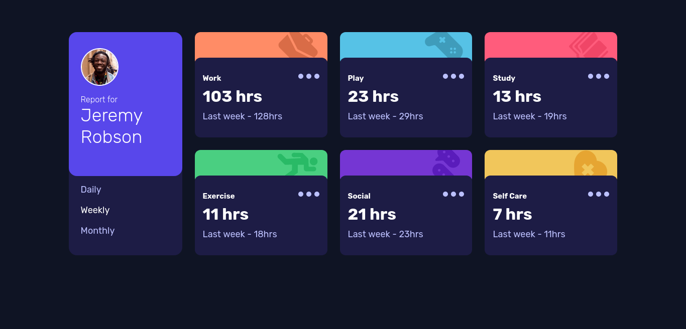
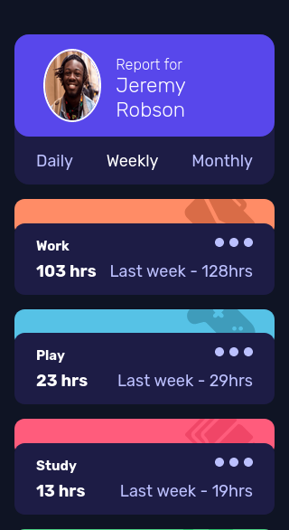

# TimeTrackerDash

# Frontend Mentor -  Time tracking Dashboard component solution(Angular 14)

This is a solution to the [Expenses chart component challenge on Frontend Mentor](https://www.frontendmentor.io/challenges/expenses-chart-component-e7yJBUdjwt). Frontend Mentor challenges help you improve your coding skills by building realistic projects.

## Table of contents

- [Overview](#overview)
  - [The challenge](#the-challenge)
  - [Screenshot](#screenshot)
  - [Links](#links)
- [My process](#my-process)
  - [Built with](#built-with)
  - [Installation](#installation)
  - [What I learned](#what-i-learned)
  - [Continued development](#continued-development)
  - [Useful resources](#useful-resources)
- [Author](#author)
- [Acknowledgments](#acknowledgments)

## Overview

### The challenge

Your users should be able to:

- View the optimal layout for the site depending on their device's screen size
- See hover states for all interactive elements on the page
- Switch between viewing Daily, Weekly, and Monthly stats

### Screenshot

### Links

- Solution URL: [solution URL](https://www.frontendmentor.io/challenges/time-tracking-dashboard-UIQ7167Jw/hub/time-tracking-dashboard-component-solutionangular-14-Z1-PRSe8yk)
- Live Site URL: [live site URL](https://polite-florentine-296e09.netlify.app/)

## My process

### Built with

- Semantic HTML5 markup
- CSS custom properties
- Mobile-first workflow
- Grid
- flexbox
- [Angular 14](https://angular.io/docs) - JS library

## Installation

This project was generated with [Angular CLI](https://github.com/angular/angular-cli) version 14.1.1.

## Development server

Run `ng serve` for a dev server. Navigate to `http://localhost:4200/`. The application will automatically reload if you change any of the source files.

## Code scaffolding

Run `ng generate component component-name` to generate a new component. You can also use `ng generate directive|pipe|service|class|guard|interface|enum|module`.

## Build

Run `ng build` to build the project. The build artifacts will be stored in the `dist/` directory.

## Running unit tests

Run `ng test` to execute the unit tests via [Karma](https://karma-runner.github.io).

## Running end-to-end tests

Run `ng e2e` to execute the end-to-end tests via a platform of your choice. To use this command, you need to first add a package that implements end-to-end testing capabilities.

## Further help

To get more help on the Angular CLI use `ng help` or go check out the [Angular CLI Overview and Command Reference](https://angular.io/cli) page.

### Useful resources

- [A guide to flexbox](https://css-tricks.com/snippets/css/a-guide-to-flexbox/) - This helped me with flexbox.
- [CSS reference](https://cssreference.io/) - This is a usefull css reference.

## Author

- Website - [Clinton wambugu](https://clintonwambugu-portfolio.herokuapp.com/)
- Frontend Mentor - [Clinton-dev](https://www.frontendmentor.io/profile/Clinton-dev)
- Twitter - [@WambuguClinton](https://twitter.com/WambuguClinton)
